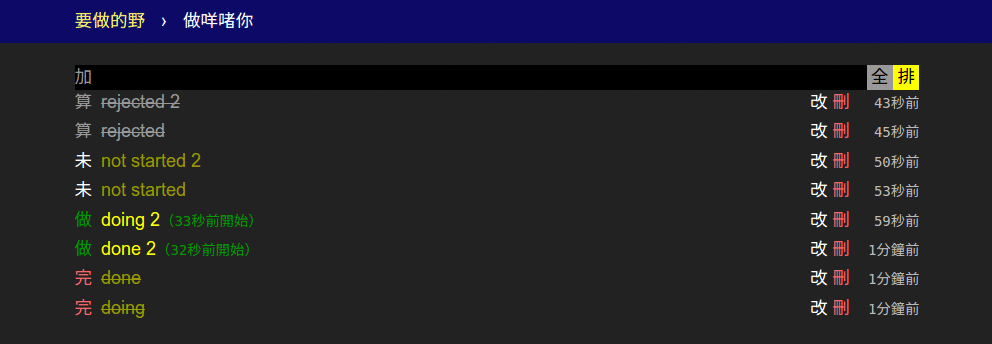
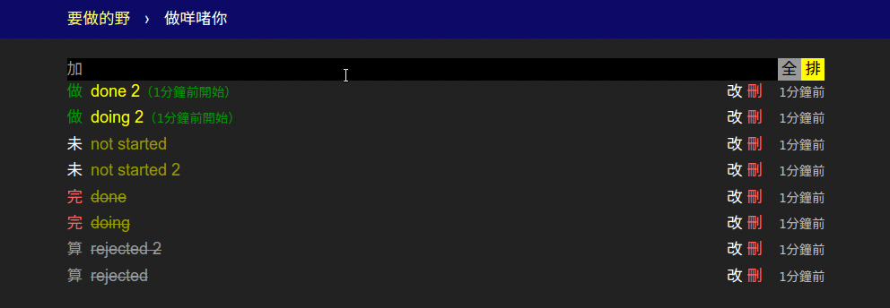
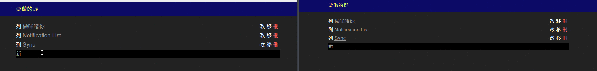
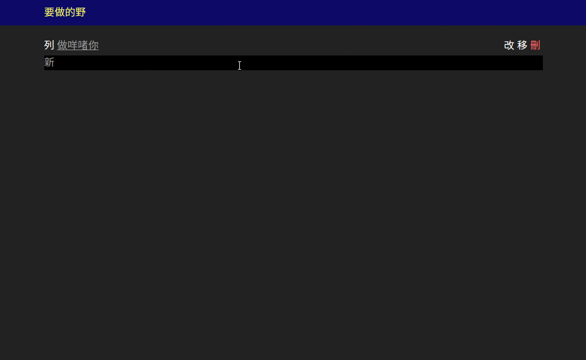

# Progressive work la 7 head

## Features

1. Add/remove tasks and lists
1. Toggle between unstarted, started, done and rejected task states
2. Markdown formatting and auto-link for task name and details
3. Schedule desktop notifications
2. Offline and noBackend with [hoodiehq/hoodie](https://github.com/hoodiehq/hoodie)
3. Sync between multiple clients

## Screenshots

Sort, reorder, hide finished and rejected tasks

Add tasks, toggle states and Markdown formatting

Sync between multiple clients

Add todo list, schedule desktop notification

